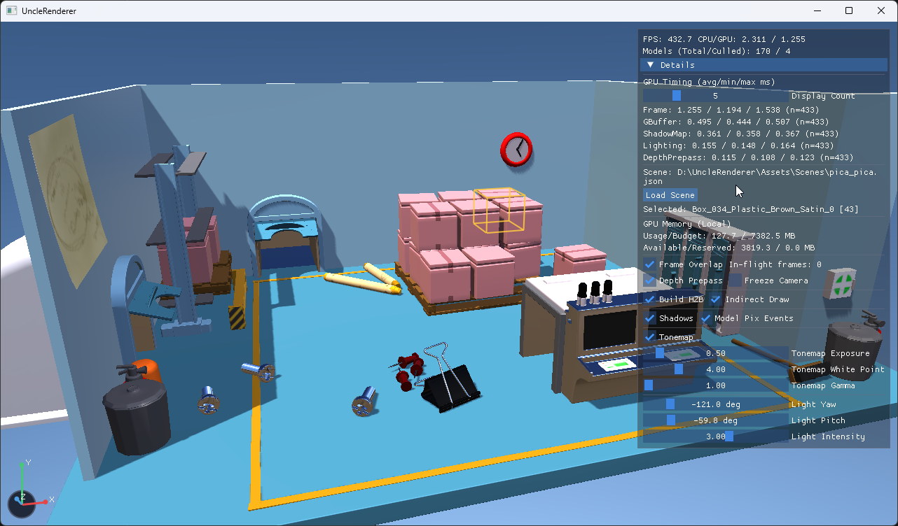

# UncleRenderer
UncleRenderer is a DirectX 12–based experimental renderer to undestand modern engine architecture.

## Setup
To use this project with ImGui support, you need to initialize the git submodules:
* In Git GUI/Git Sync: Use **SubModule Update** to download the ImGui submodule
* Or via command line: `git submodule update --init --recursive`

## Features
* DirectX 12–based renderer
* Forward and Deferred rendering paths
* GPU-driven indirect draw and frustum culling
* HZB-based occlusion culling (max 4 mips per dispatch)
* Physically Based Rendering (GGX)
* Image-Based Lighting (IBL, BRDF LUT)
* Directional shadow mapping
* Render Graph–based pipeline (Barriers, Resource aliasing)
* glTF 2.0 scene and material support
* Asynchronous scene and texture loading (Task system)
* Sky / Atmosphere Rendering (Rayleigh / Mie)
* Auto Exposure / Tonemapping Pass
* ImGui-based debug and profiling UI (D3D12 Timestamp Query)
