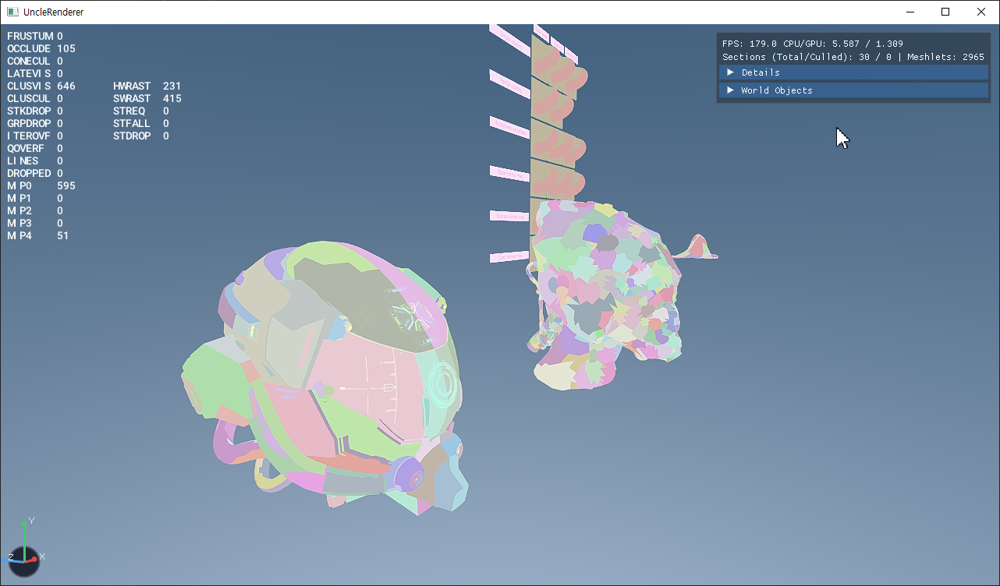
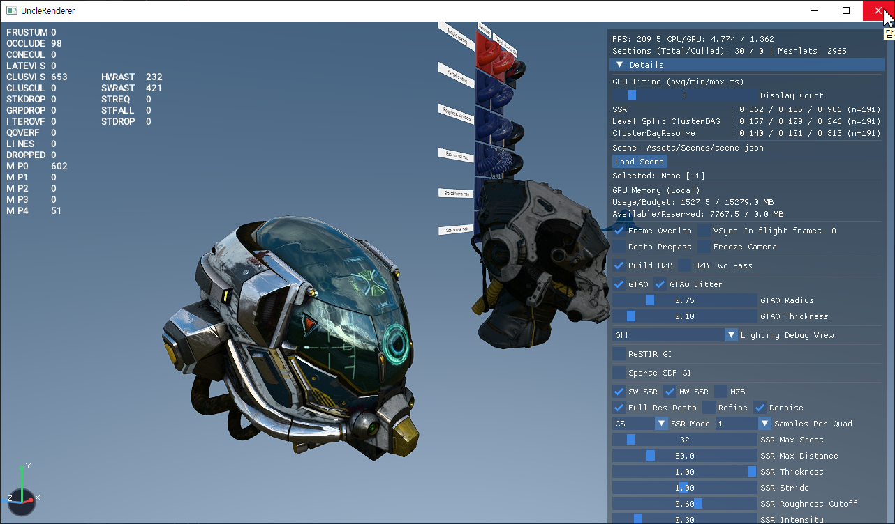
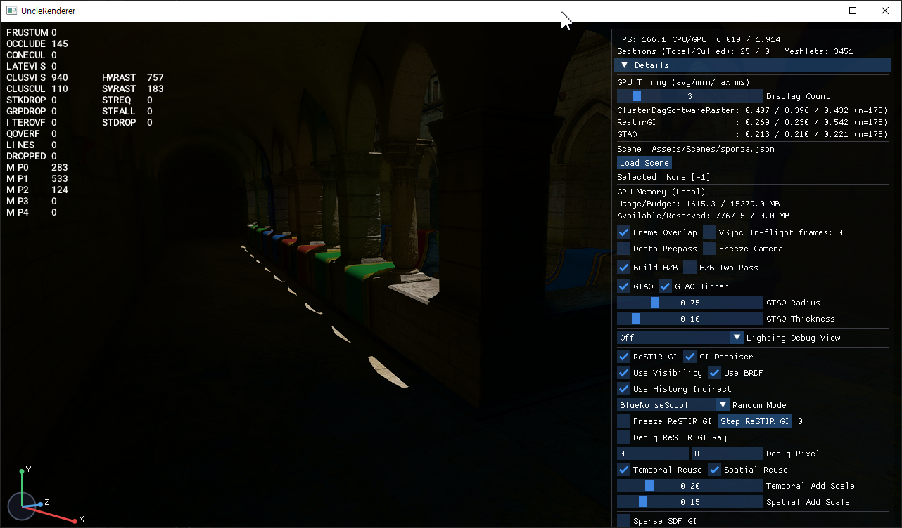
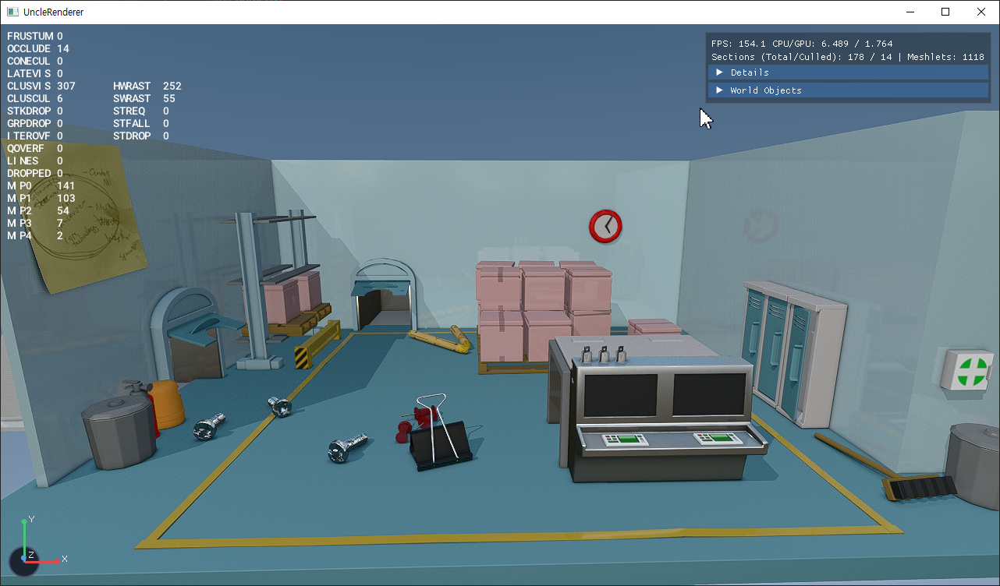

# UncleRenderer

UncleRenderer is a DirectX 12–based experimental renderer to understand modern engine architecture.
It is an open, learning-oriented codebase that implements production-grade rendering techniques from the ground up — a practical reference for studying how a modern real-time renderer is built.

### Highlights
* **GPU-driven pipeline** – indirect draw, frustum/HZB occlusion culling, and meshlet rendering driven entirely on the GPU
* **Cluster DAG** – hierarchical LOD selection, page streaming, and a software rasterizer for sub-pixel clusters (Nanite-style)
* **Global illumination** – offline Path Tracer, real-time ReSTIR GI, and a work-in-progress Sparse SDF GI
* **Modern feature set** – DXR ray-traced shadows/reflections, PBR with extended material models, and a full post-processing stack

## Requirements
* Windows 10 / 11 (x64)
* A DirectX 12 capable GPU — hardware ray tracing (DXR) features require a DXR-capable GPU
* Visual Studio 2022 (v143 toolset) with the Windows 10 SDK and the "Desktop development with C++" workload

## Build & Run
1. Clone the repository and initialize the git submodules (required for ImGui):
   * In Git GUI/Git Sync: use **SubModule Update** to download the ImGui submodule
   * Or via command line: `git submodule update --init --recursive`
2. Open `UncleRenderer.sln` in Visual Studio 2022.
3. Select the `x64` `Debug` or `Release` configuration and build (NuGet restores the Agility SDK / DXC / PIX packages automatically).
4. Run from Visual Studio — required runtime DLLs (D3D12 Agility SDK, DXC, PIX) are copied to the output directory as a post-build step.

## Features

### Core Rendering
* DirectX 12–based renderer
* Forward and Deferred rendering paths
* Render Graph–based pipeline (Barriers, Resource aliasing)
* glTF 2.0 scene and material support

### GPU-Driven Pipeline
* GPU-driven indirect draw and frustum culling
* HZB-based occlusion culling (max 4 mips per dispatch)
* Meshlet-based rendering with per-meshlet culling (early/late visibility, early reject)
* Cluster DAG – hierarchical LOD selection and culling with target pixel error control
* meshoptimizer-based mesh simplification (quadric error metric) for Cluster DAG LOD generation
* Cluster DAG visibility buffer resolve integrated into deferred rendering
* Cluster DAG software rasterization for small clusters (HZB rejection, double-sided/backface handling, indirect dispatch)
* Cluster DAG page streaming with feedback-driven priority scheduling and per-page local fetch

### Materials & Lighting
* Physically Based Rendering (GGX)
* Image-Based Lighting (IBL, BRDF LUT)
* Extended PBR material models: Sheen (cloth), Clearcoat, Anisotropy
* Alpha masking and double-sided material support
* Directional shadow mapping
* Ray Traced Shadows (DXR)

### Global Illumination
* Path Tracer (VNDF sampling, configurable bounces, accumulation)
* ReSTIR GI – reservoir-based spatio-temporal importance resampling for indirect lighting
* ReSTIR GI Denoiser (pre-blur, temporal accumulation, SH mip generation, history reconstruction, final blur)
* 🚧 Sparse SDF GI *(work in progress)* – Brixelizer-inspired sparse signed-distance-field global illumination with SDF cone/ray tracing, brick radiance cache injected from the GBuffer, temporal reuse, and debug views

### Reflections & Ambient Occlusion
* Screen-Space Reflections (SSR) – HZB-accelerated ray marching + DXR hardware ray tracing
* SSR Denoiser with edge-aware filtering
* Ground Truth Ambient Occlusion (XeGTAO)

### Post-Processing
* Temporal Anti-Aliasing (TAA) with motion vectors
* Auto Exposure (eye adaptation)
* PBR Neutral Tonemapping
* Robust Contrast Aware Sharpness (CAS)

### Environment
* Sky / Atmosphere Rendering (Rayleigh / Mie)
* Environment map prefiltering and Spherical Harmonics (SH) irradiance

### Animation
* glTF 2.0 skeletal animation
* GPU skinning via compute shader

### Tools & Debug
* Asynchronous scene and texture loading (Task system)
* Object ID rendering (GPU instance picking)
* GPU debug system (print, debug boxes/lines, statistics)
* ImGui-based debug and profiling UI (D3D12 Timestamp Query)

## Documentation
Detailed design and implementation notes live in [`doc/`](doc/):

**Cluster DAG**
* [Builder Overview](doc/ClusterDAG-Builder-Overview.md) – build pipeline, grouping, and LOD generation
* [Traversal Overview](doc/ClusterDAG-Traversal-Overview.md) – runtime LOD selection and culling
* [Visibility Buffer](doc/ClusterDAG-VisibilityBuffer-v1.md) – visibility-buffer resolve path
* [Flat-Shaded Permissive Simplification](doc/ClusterDAG-FlatShaded-Simplify-Permissive.md) – meshoptimizer simplification tuning
* [Whole-Mesh Path](doc/ClusterDAG-WholeMesh-v1.md)
* Streaming: [v1](doc/ClusterDAG-Streaming-v1.md), [v3 Plan](doc/ClusterDAG-Streaming-v3-Plan.md)

**Sparse SDF GI** *(work in progress)*
* Build pipeline: [v1](doc/SparseSdfGI-v1.md), [v2](doc/SparseSdfGI-v2.md), [v3](doc/SparseSdfGI-v3.md)
* Radiance: [Radiance Cache](doc/SparseSdfGI-Radiance-v1.md), [Radiance Denoise](doc/SparseSdfGI-Radiance-Denoise-v1.md)

## Third-Party / Open-Source Libraries
UncleRenderer is built on top of these open-source projects:

| Library | Purpose |
| --- | --- |
| [Dear ImGui](https://github.com/ocornut/imgui) | Immediate-mode debug and profiling UI |
| [cgltf](https://github.com/jkuhlmann/cgltf) | glTF 2.0 scene and animation loading |
| [meshoptimizer](https://github.com/zeux/meshoptimizer) | Mesh optimization, meshlet building, and LOD simplification |
| [stb](https://github.com/nothings/stb) | Image loading / writing |
| [ddspp](https://github.com/redorav/ddspp) | DDS texture header parsing |
| [AMD FidelityFX SDK](https://github.com/GPUOpen-LibrariesAndSDKs/FidelityFX-SDK) | Single-Pass Downsampler (SPD) and reflection denoiser shader routines |
| [DirectX 12 Agility SDK](https://devblogs.microsoft.com/directx/directx12agility/) | Up-to-date D3D12 runtime and features |
| [DirectX Shader Compiler (DXC)](https://github.com/microsoft/DirectXShaderCompiler) | HLSL shader compilation (SM 6.x) |
| [WinPixEventRuntime](https://devblogs.microsoft.com/pix/) | PIX GPU capture markers and events |

## References & Acknowledgements
Techniques and papers that informed this renderer's implementation:

* **Cluster DAG** – inspired by Unreal Engine's [Nanite](https://advances.realtimerendering.com/s2021/Karis_Nanite_SIGGRAPH_Advances_2021_final.pdf) virtualized geometry
* **ReSTIR GI** – [Ouyang et al., "ReSTIR GI: Path Resampling for Real-Time Path Tracing"](https://research.nvidia.com/publication/2021-06_restir-gi-path-resampling-real-time-path-tracing) (2021)
* **Sparse SDF GI** – build pipeline modeled after AMD [FidelityFX Brixelizer / Brixelizer GI](https://gpuopen.com/fidelityfx-brixelizer-gi/)
* **GTAO** – [Jiménez et al., "Practical Realtime Strategies for Accurate Indirect Occlusion"](https://www.activision.com/cdn/research/Practical_Real_Time_Strategies_for_Accurate_Indirect_Occlusion_NEW%20VERSION_COLOR.pdf), via Intel's [XeGTAO](https://github.com/GameTechDev/XeGTAO)
* **Single-Pass Downsampler (SPD)** – AMD FidelityFX SPD for HZB / mip-chain generation
